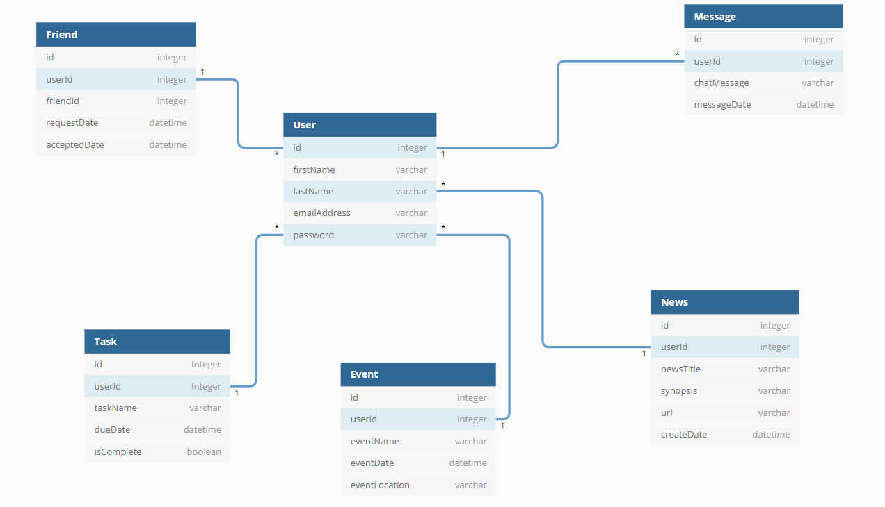

# Nutshell: The Information Dashboard

## What is this application

Nutstalgia is a dashboard application that displays a users friends tasks, events, chats and news regarding their life. It's a dashboard for people to use and to organize their daily tasks, events, news article, friends, and chat messages.

1. Clone this repository
1. `cd` into the directory it creates
1. Make a `database.json` file in the `api` directory
1. Run `npm install` and wait for all dependencies to be installed
1. Run `npm start` to verify that installation was successful.

## Nutstalgia Awesome Team Members

* Dylan Griffith
* Quin Smith
* Shirish Shrestha
* Keaton Williamson


## Instructions:
1. Clone this repository
1. `cd` into the directory it creates
1. Make a `database.json` file in the `api` directory and import this gist 

1. Run `npm install` and wait for all dependencies to be installed
1. Run `npm start` to verify that installation was successful.

```json
{
  "users": [],
  "news": [],
  "events": [],
  "tasks": [],
  "friendships": [],
  "requests": []
}
```

### Image of Db Diagram



